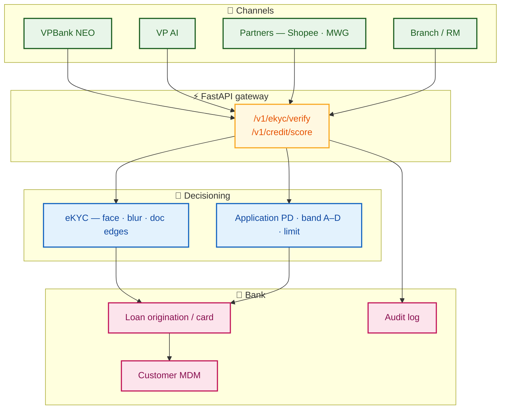
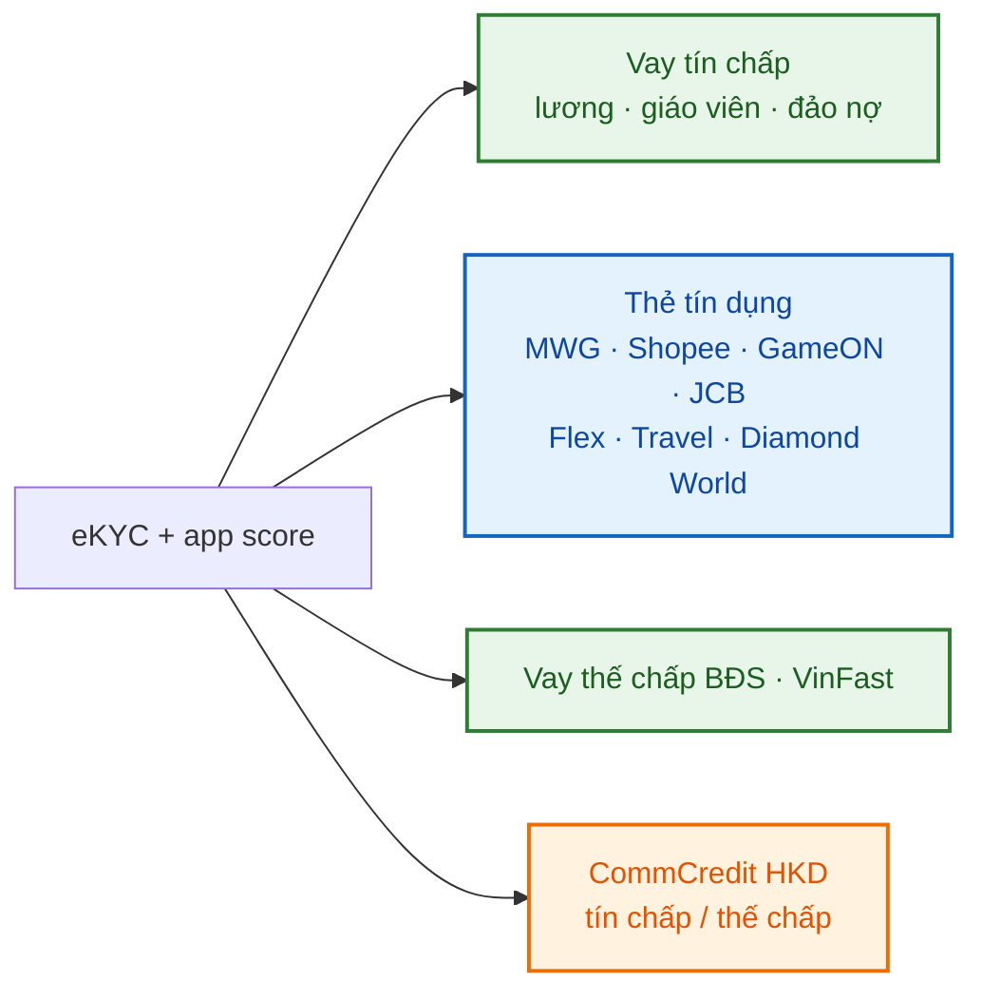
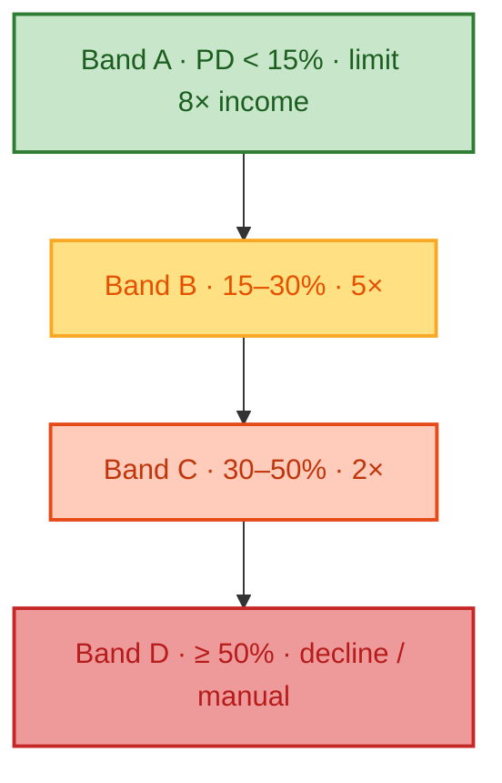

# VPBank — eKYC & Credit Scoring ML Services

Digital-bank **onboarding** for a VPBank-shaped retail bank: **eKYC** image checks + **application PD** via FastAPI, aligned to public product themes on [Cá nhân](https://www.vpbank.com.vn/ca-nhan) and [Hộ kinh doanh](https://www.vpbank.com.vn/ho-kinh-doanh).

Book-level IFRS 9 / ECL engine (after the loan exists): companion pattern in a credit-risk solution repo.

**Role:** Data Engineer · **Year:** 2019

---

## Digital bank onboarding



## Product themes this API feeds



| Line | Public theme | Risk use of this API |
|------|----------------|----------------------|
| Cá nhân | [Vay tín chấp / thế chấp](https://www.vpbank.com.vn/ca-nhan/vay) | KYC gate + PD band before LOS |
| Cá nhân | [Thẻ tín dụng](https://www.vpbank.com.vn/ca-nhan/the-tin-dung) | Same PD bands; limit × income |
| HKD | [CommCredit](https://www.vpbank.com.vn/ho-kinh-doanh) | Onboarding KYC for hộ kinh doanh |
| Segments | Prime · Diamond · Private | Same API; policy overlay in LOS |



## Tech stack

| Module | Technology |
|--------|------------|
| Credit scoring | scikit-learn, StandardScaler + LogisticRegression |
| eKYC vision | OpenCV (Haar face cascade, Laplacian blur, Canny edges) |
| API | FastAPI, multipart upload |
| Model registry | Joblib artifacts under `models/` |

## Quick start

```bash
python -m venv .venv && source .venv/bin/activate
pip install -r requirements.txt
python scripts/demo_run.py
uvicorn src.api.main:app --reload --port 8080
```

## API examples

```bash
# Credit score
curl -X POST http://localhost:8080/v1/credit/score \
  -H "Content-Type: application/json" \
  -d "{\"age\":32,\"monthly_income_vnd\":25000000,\"employment_months\":48,\"existing_loans\":1,\"delinquency_12m\":0,\"credit_utilization_pct\":35}"

# eKYC (multipart)
curl -X POST http://localhost:8080/v1/ekyc/verify -F "file=@data/raw/sample_selfie.png"
```

## Layout

```
vpbank-ekyc-credit-scoring/
├── src/credit/     # Scoring model train + inference
├── src/ekyc/       # Image verification heuristics
├── src/api/        # FastAPI gateway
├── models/         # Serialized pipelines
└── scripts/        # Local demo
```

## Production notes

- Replace synthetic training data with governed feature store exports.
- Swap Haar cascade with ONNX face model + liveness detection in production.
- Log all scores with model version hash for regulatory audit.

---

*Portfolio reconstruction from public VPBank product pages. No customer PII.*

**WillTran** — Senior Data Engineer
