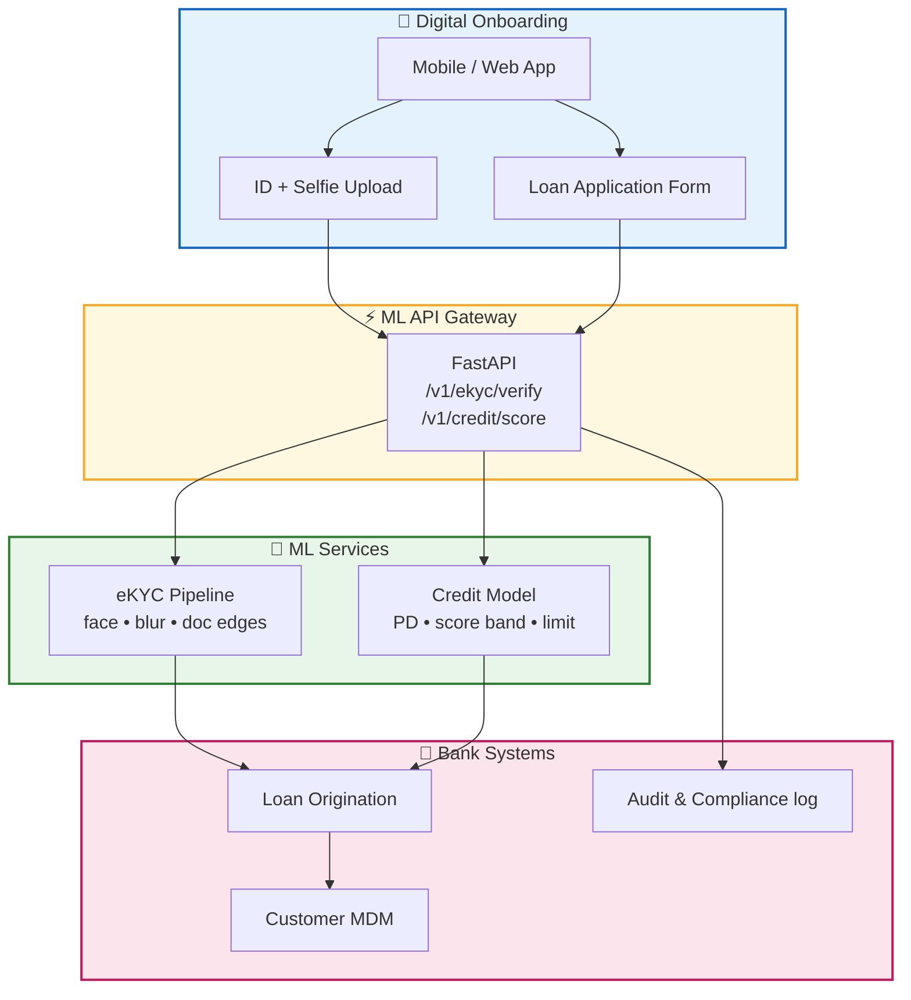

# VPBank — eKYC & Credit Scoring ML Services

Banking ML portfolio: **credit scoring** (logistic regression on applicant features) and **eKYC** image verification (face detection, blur, document edge checks) exposed via a unified **FastAPI** service.

**Role:** Data Engineer · **Year:** 2019

## Tech Stack

| Module | Technology |
|--------|------------|
| Credit scoring | scikit-learn, StandardScaler + LogisticRegression |
| eKYC vision | OpenCV (Haar face cascade, Laplacian blur, Canny edges) |
| API | FastAPI, multipart upload |
| Model registry | Joblib artifacts under `models/` |

## Architecture



## Score Bands

| Band | Default probability | Typical limit multiplier (× monthly income) |
|------|---------------------|-----------------------------------------------|
| A | &lt; 15% | 8× |
| B | 15–30% | 5× |
| C | 30–50% | 2× |
| D | ≥ 50% | 0 (manual review) |

## Quick Start

```bash
python -m venv .venv && .venv\Scripts\activate
pip install -r requirements.txt
python scripts/demo_run.py
uvicorn src.api.main:app --reload --port 8080
```

## API Examples

```bash
# Credit score
curl -X POST http://localhost:8080/v1/credit/score \
  -H "Content-Type: application/json" \
  -d "{\"age\":32,\"monthly_income_vnd\":25000000,\"employment_months\":48,\"existing_loans\":1,\"delinquency_12m\":0,\"credit_utilization_pct\":35}"

# eKYC (multipart)
curl -X POST http://localhost:8080/v1/ekyc/verify -F "file=@data/raw/sample_selfie.png"
```

## Repository Layout

```
vpbank-ekyc-credit-scoring/
├── src/credit/     # Scoring model train + inference
├── src/ekyc/       # Image verification heuristics
├── src/api/        # FastAPI gateway
├── models/         # Serialized pipelines
└── scripts/        # Local demo
```

## Production Notes

- Replace synthetic training data with governed feature store exports.
- Swap Haar cascade with ONNX face model + liveness detection in production.
- Log all scores with model version hash for regulatory audit.

---

*Portfolio reconstruction. No VPBank customer PII included.*
